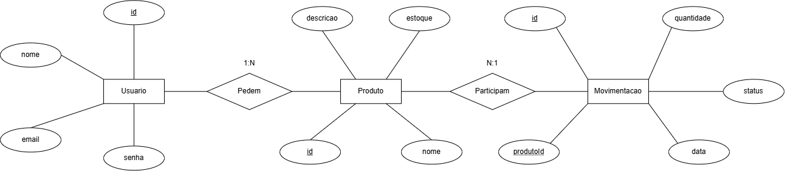

# Lista de Requisitos Funcionais

- **[RF01]** Interface de autenticação de usuários (login)
  - **[RF01.1]** Solicitar email e senha
  - **[RF01.2]** Validar credenciais do usuário
  - **[RF01.3]** Redirecionar para interface principal do sistema

- **[RF02]** Interface principal do sistema
  - **[RF02.1]** Redirecionamento para interface de cadastro de produto
  - **[RF02.2]** Redirecionamento para interface gestão de produção
  - **[RF02.3]** Redirecionamento para sair do sistema, levando-o à interface de login
  - **[RF02.4]** Mostrar nome do usuário
  - **[RF02.5]** Listar os produtos cadastrados

- **[RF03]** Interface cadastro de produto
  - **[RF03.1]** Cadastrar produto
  - **[RF03.2]** Editar produto
  - **[RF03.3]** Excluir produto
  - **[RF03.4]** Retornar à interface principal
  - **[RF03.5]** Campo de busca

- **[RF04]** Interface gestão de produção (Just in Time)
  - **[RF04.1]** Ver o status do produto
  - **[RF04.2]** Inserir data de começo e fim de produção
  - **[RF04.3]** Listagem em ordem alfabética
  - **[RF04.4]** Alerta de estoque

---

# DER (Diagrama de Relacionamento de Entidades)

---

# Casos de Teste

## Interface de autenticação de usuários (login)

### CT01

**Requisito Funcional:** RF01.1 - Solicitar email e senha

**Descrição:** Verificar se a interface de autenticação solicita email e senha.

**Pré-condições:**

- O sistema deve estar acessível.
- O usuário deve estar na interface de login.

**Passos:**

1. Acessar a interface de login.
2. Verificar se o campo de email está presente.
3. Verificar se o campo de senha está presente.
4. Verificar se existe um botão para realizar o login.

**Resultado Esperado:**

Os campos de email e senha e o botão de login devem estar visíveis e disponíveis para utilização.

---

### CT02

**Requisito Funcional:** RF01.2 - Validar credenciais do usuário

**Descrição:** Verificar se o sistema valida corretamente as credenciais informadas pelo usuário.

**Pré-condições:**

- O sistema deve estar acessível.
- Deve existir um usuário cadastrado.

**Passos:**

1. Acessar a interface de login.
2. Informar um email cadastrado.
3. Informar a senha correspondente.
4. Clicar no botão de login.
5. Repetir o teste utilizando uma senha incorreta.

**Resultado Esperado:**

Com as credenciais corretas, o acesso deve ser permitido. Com credenciais incorretas, o sistema deve impedir o acesso e apresentar uma mensagem de erro.

---

### CT03

**Requisito Funcional:** RF01.3 - Redirecionar para interface principal do sistema

**Descrição:** Verificar se o usuário é direcionado para a interface principal após realizar o login corretamente.

**Pré-condições:**

- O sistema deve estar acessível.
- Deve existir um usuário cadastrado com credenciais válidas.

**Passos:**

1. Acessar a interface de login.
2. Informar email e senha válidos.
3. Clicar no botão de login.

**Resultado Esperado:**

O sistema deve autenticar o usuário e redirecioná-lo para a interface principal.

---

## Interface principal do sistema

### CT04

**Requisito Funcional:** RF02.1 - Redirecionamento para interface de cadastro de produto

**Descrição:** Verificar se a opção de cadastro de produto direciona o usuário para a interface correta.

**Pré-condições:**

- O usuário deve estar autenticado.
- O usuário deve estar na interface principal.

**Passos:**

1. Acessar a interface principal.
2. Localizar a opção de cadastro de produto.
3. Clicar na opção.

**Resultado Esperado:**

O sistema deve redirecionar o usuário para a interface de cadastro de produto.

---

### CT05

**Requisito Funcional:** RF02.2 - Redirecionamento para interface de gestão de produção

**Descrição:** Verificar se a opção de gestão de produção direciona o usuário para a interface correta.

**Pré-condições:**

- O usuário deve estar autenticado.
- O usuário deve estar na interface principal.

**Passos:**

1. Acessar a interface principal.
2. Localizar a opção de gestão de produção.
3. Clicar na opção.

**Resultado Esperado:**

O sistema deve redirecionar o usuário para a interface de gestão de produção.

---

### CT06

**Requisito Funcional:** RF02.3 - Redirecionamento para sair do sistema

**Descrição:** Verificar se a opção de sair encerra o acesso e retorna o usuário para a interface de login.

**Pré-condições:**

- O usuário deve estar autenticado.
- O usuário deve estar na interface principal.

**Passos:**

1. Acessar a interface principal.
2. Clicar na opção de sair.
3. Verificar a interface apresentada.

**Resultado Esperado:**

O sistema deve encerrar o acesso do usuário e redirecioná-lo para a interface de login.

---

### CT07

**Requisito Funcional:** RF02.4 - Mostrar nome do usuário

**Descrição:** Verificar se o nome do usuário autenticado é apresentado na interface principal.

**Pré-condições:**

- Deve existir um usuário cadastrado.
- O usuário deve realizar login com credenciais válidas.

**Passos:**

1. Realizar login com um usuário cadastrado.
2. Acessar a interface principal.
3. Verificar a identificação apresentada na tela.

**Resultado Esperado:**

O sistema deve apresentar o nome do usuário autenticado na interface principal.

---

### CT08

**Requisito Funcional:** RF02.5 - Listar os produtos cadastrados

**Descrição:** Verificar se os produtos cadastrados são apresentados na interface principal.

**Pré-condições:**

- O usuário deve estar autenticado.
- Deve existir pelo menos um produto cadastrado.

**Passos:**

1. Acessar a interface principal.
2. Verificar a lista de produtos apresentada.

**Resultado Esperado:**

O sistema deve apresentar os produtos cadastrados corretamente.

---

## Interface de cadastro de produto

### CT09

**Requisito Funcional:** RF03.1 - Cadastrar produto

**Descrição:** Verificar se um novo produto pode ser cadastrado no sistema.

**Pré-condições:**

- O usuário deve estar autenticado.
- A interface de cadastro deve estar acessível.

**Passos:**

1. Acessar a interface de cadastro de produto.
2. Informar o nome do produto.
3. Informar a descrição.
4. Informar a quantidade de estoque.
5. Confirmar o cadastro.

**Resultado Esperado:**

O produto deve ser cadastrado e aparecer na lista de produtos.

---

### CT10

**Requisito Funcional:** RF03.2 - Editar produto

**Descrição:** Verificar se os dados de um produto cadastrado podem ser alterados.

**Pré-condições:**

- O usuário deve estar autenticado.
- Deve existir pelo menos um produto cadastrado.

**Passos:**

1. Acessar a lista de produtos.
2. Selecionar um produto.
3. Clicar na opção de atualizar.
4. Alterar o nome, descrição ou estoque.
5. Salvar a alteração.

**Resultado Esperado:**

Os dados do produto devem ser atualizados e apresentados com os novos valores.

---

### CT11

**Requisito Funcional:** RF03.3 - Excluir produto

**Descrição:** Verificar se um produto cadastrado pode ser excluído.

**Pré-condições:**

- O usuário deve estar autenticado.
- Deve existir um produto cadastrado que não possua movimentações relacionadas.

**Passos:**

1. Acessar a lista de produtos.
2. Selecionar o produto desejado.
3. Clicar na opção de excluir.
4. Confirmar a exclusão.

**Resultado Esperado:**

O produto deve ser removido da lista de produtos.

---

### CT12

**Requisito Funcional:** RF03.4 - Retornar à interface principal

**Descrição:** Verificar se o usuário consegue retornar à interface principal a partir da interface de cadastro de produtos.

**Pré-condições:**

- O usuário deve estar autenticado.
- O usuário deve estar na interface de cadastro de produtos.

**Passos:**

1. Acessar a interface de cadastro de produtos.
2. Localizar a opção de retorno.
3. Clicar na opção.

**Resultado Esperado:**

O sistema deve redirecionar o usuário para a interface principal.

---

### CT13

**Requisito Funcional:** RF03.5 - Campo de busca

**Descrição:** Verificar se o campo de busca permite filtrar produtos pelo nome.

**Pré-condições:**

- O usuário deve estar autenticado.
- Devem existir vários produtos cadastrados.

**Passos:**

1. Acessar a interface de cadastro de produtos.
2. Localizar o campo de busca.
3. Informar parte do nome de um produto.
4. Verificar a lista apresentada.
5. Alterar o texto da busca.

**Resultado Esperado:**

O sistema deve apresentar somente os produtos que possuem os caracteres informados no campo de busca, independentemente de letras maiúsculas ou minúsculas.

---

## Interface de gestão de produção (Just in Time)

### CT14

**Requisito Funcional:** RF04.1 - Ver o status do produto

**Descrição:** Verificar se o status da movimentação do produto é apresentado corretamente.

**Pré-condições:**

- O usuário deve estar autenticado.
- Deve existir pelo menos uma movimentação cadastrada.

**Passos:**

1. Acessar a interface de gestão de produção.
2. Localizar uma movimentação.
3. Verificar o status apresentado.

**Resultado Esperado:**

O sistema deve apresentar corretamente o status da movimentação, como "Pedido" ou "Produzido".

---

### CT15

**Requisito Funcional:** RF04.2 - Inserir data de começo e fim de produção

**Descrição:** Verificar se o sistema permite inserir as datas relacionadas à produção.

**Pré-condições:**

- O usuário deve estar autenticado.
- A interface de gestão de produção deve estar acessível.

**Passos:**

1. Acessar a interface de gestão de produção.
2. Selecionar um produto ou movimentação.
3. Informar a data de começo da produção.
4. Informar a data de fim da produção.
5. Salvar as informações.

**Resultado Esperado:**

As datas informadas devem ser aceitas pelo sistema e apresentadas corretamente na movimentação.

---

### CT16

**Requisito Funcional:** RF04.3 - Listagem em ordem alfabética

**Descrição:** Verificar se os produtos são apresentados em ordem alfabética.

**Pré-condições:**

- O usuário deve estar autenticado.
- Devem existir dois ou mais produtos cadastrados com nomes diferentes.

**Passos:**

1. Acessar a interface de gestão de produção.
2. Verificar a ordem dos produtos apresentados.
3. Comparar os nomes dos produtos.

**Resultado Esperado:**

Os produtos devem ser apresentados em ordem alfabética pelo nome.

---

### CT17

**Requisito Funcional:** RF04.4 - Alerta de estoque

**Descrição:** Verificar se o sistema apresenta um alerta quando um produto possui estoque baixo.

**Pré-condições:**

- O usuário deve estar autenticado.
- Deve existir um produto com estoque inferior ao limite estabelecido pelo sistema.

**Passos:**

1. Cadastrar ou selecionar um produto com estoque baixo.
2. Acessar a interface de gestão de produção.
3. Verificar se o alerta de estoque é apresentado.

**Resultado Esperado:**

O sistema deve apresentar um alerta informando que existem produtos com estoque baixo.

---

# Ferramentas e Ambientes de Teste

## Ferramentas utilizadas

### Navegador Web

Utilizado para realizar os testes manuais da interface do sistema, verificando o funcionamento das telas, formulários, botões, redirecionamentos, filtros, mensagens de erro e demais funcionalidades disponíveis para o usuário.

### Insomnia 13.2.0

Utilizado para realizar testes diretamente na API do sistema, permitindo enviar requisições HTTP e verificar as respostas retornadas pelo servidor.

Foram realizados testes utilizando as principais operações da API:

- **GET** para listagem de produtos e movimentações;
- **POST** para cadastro de produtos e movimentações;
- **PUT** para atualização de produtos;
- **DELETE** para exclusão de produtos.

## Ambiente de Teste

Os testes foram realizados em ambiente de desenvolvimento local.

O sistema foi executado localmente, com o front-end sendo acessado através de um navegador web e as requisições da API sendo testadas utilizando o Insomnia 13.2.0.

O navegador foi utilizado para verificar o funcionamento das interfaces e a interação do usuário com o sistema.

O Insomnia 13.2.0 foi utilizado para verificar o funcionamento das rotas do back-end e as respostas retornadas pela API.

---

# Lista de requisitos de Infraestrutura

## SGBD
- MySQL - 10.4.32-MariaDB (Utilizei ``SELECT VERSION()``)
- ORM
    - Prisma - prisma@8.0.0-rc.13
##  Linguagem de programação
- JavaScript (Com Node.js - v24.18.1)
## Sistema operacional 
- Edição - Windows 11 Pro
- Versão - 25H2
- Instalado - 24/01/2025
- Compilação do SO - 26200.8246
- Experiência - Pacote de Experiência de Recursos do Windows 1000.26100.297.0
