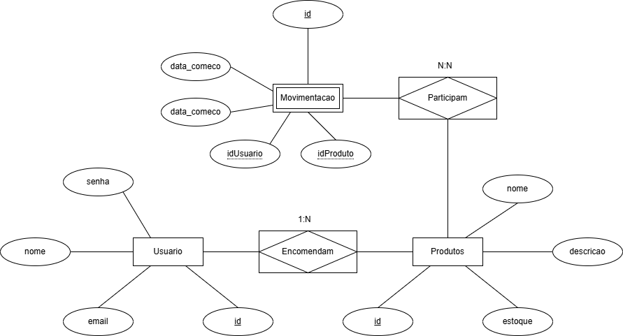

# Lista de Requisitos Funcionais

- [RF01] Interface de autenticação de usuários (login)
    - [RF01.1] Solicitar email e senha 
    - [RF01.2] Validar credenciais do usuario
    - [RF01.3] Redirecionar para interface principal do sistema
- [RF02] Interface principal do sistema
    - [RF02.1] Redirecionamento para interface de cadastro de produto
    - [RF02.2] Redirecionamento para interface gestão de produção
    - [RF02.3] Redirecionamento para sair do sistema, levando-o a interface de login
    - [RF02.4] Mostrar nome do usuário
    - [RF02.5] Listar os produtos cadastrados
- [RF03] Interface cadastro de produto
    - [RF03.1] Cadastrar produto
    - [RF03.2] Editar produto
    - [RF03.3] Excluir produto		
    - [RF03.4] Retornar a interface principal
    - [RF03.5] Campo de busca
- [RF04] Interface gestão de produção (Just in time)
    - [RF04.1] Ver o status do produto
    - [RF04.2] Inserir data de começo e fim de produção
    - [RF04.3] Listagem em ordem alfabética
    - [RF04.4] Alerta de estoque

## DER(Diagraa de Relacionamento de Entidades)
